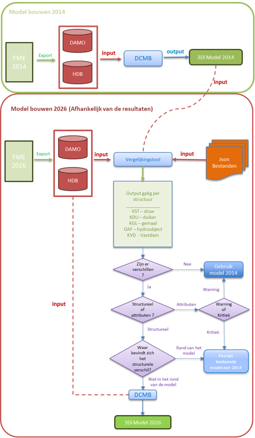
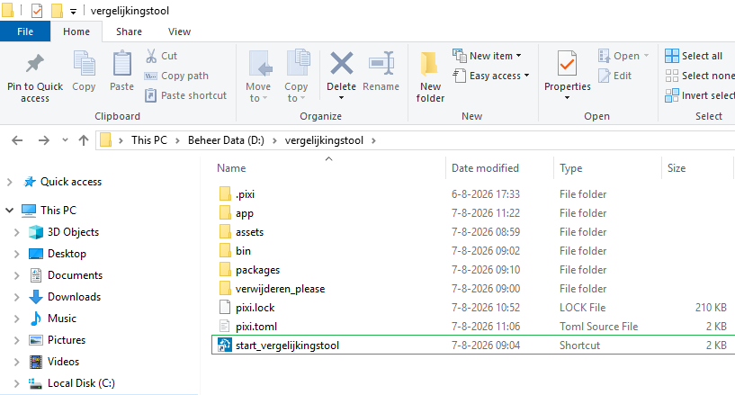
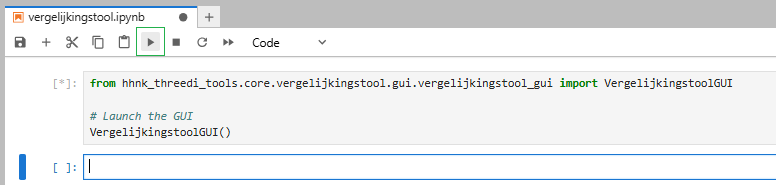
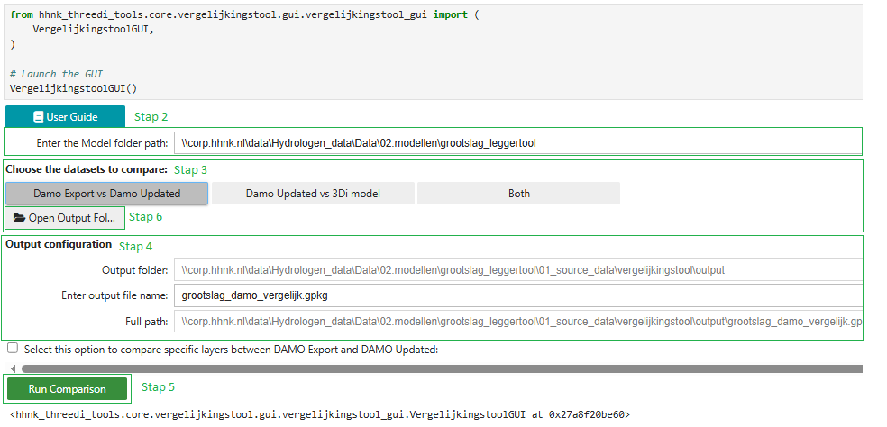

## Inhoudsopgave

- [Workflow](#workflow)
- [Benodigde input](#benodigde-input)
- [Gebruik van de Vergelijkingstool](#gebruik-van-de-vergelijkingstool)
- [Interpretatie van de resultaten](#interpretatie-van-de-resultaten)
- [Vastlegging van de beoordeling](#vastlegging-van-de-beoordeling)
- [Aanbevolen werkwijze in het kort](#aanbevolen-werkwijze-in-het-kort)
- [Contact](#contact)

## **Vergelijkingstool**
Binnen HHNK worden 3Di modellen opgebouwd met brongegevens uit DAMO en de lokale HDB-database. Deze gegevens worden via FME geëxporteerd. Met de vergelijkingstool kunnen modelleurs verschillen inzichtelijk maken tussen een recente DAMO- en HDB-export en een bestaand 3Di model. Daarnaast kan dezelfde export worden vergeleken met een oudere DAMO- en HDB-dataset. De tool vergelijkt onder andere:

| Onderdeel | Controle |
| --- | --- |
| Watergangen | Aanwezigheid, geometrie en attributen |
| Kunstwerken | Verschillen in ligging en kenmerken |
| Peilgebieden | Controle van actuele grenzen en waterpeilen |
| Modelinput | Vergelijking tussen de bestaande modelgegevens en de nieuwe DAMO en HDB export |

Het doel is niet om automatisch te bepalen wat “goed” of “fout” is, maar om verschillen zichtbaar te maken, zodat daarna een inhoudelijke beoordeling kan worden uitgevoerd.


## Workflow

Op basis van de vergelijking kan worden beoordeeld of het bestaande model nog geschikt is voor hergebruik, met enkele aanpassingen kan worden bijgewerkt, of opnieuw moet worden opgebouwd.

Het onderstaande stroomschema toont de algemene workflow en de bijbehorende besluitvorming. Het jaar 2014 wordt hierin alleen gebruikt als voorbeeld van een oudere brondata-export. Het diagram laat zien hoe de resultaten van de vergelijkingstool kunnen worden gebruikt om een onderbouwde keuze te maken tussen hergebruik, aanpassing of nieuwbouw van het model.



## Benodigde input

De vergelijkingstool verwacht dat de invoerbestanden volgens een vaste mappenstructuur zijn opgeslagen. Het model moet minimaal de volgende mappen bevatten:
```text
model_folder/
    ├── 00_config
    ├── 01_source_data
    ├── 02_schematisation
    ├── 03_3di_results
    ├── 04_test_results
    └── Notebooks
```

Binnen deze structuur leest de tool de gegevens uit de volgende locaties:
```text
model_folder/
    ├── 01_source_data/
    │   ├── polder_polygon.gpkg
    │   ├── DAMO.gpkg                        ← Oude DAMO-export
    │   ├── HDB.gpkg                         ← Oude HDB-export
    │   └── vergelijkingstool/
    │       ├── input_nieuwe_export/
    │       │   ├── DAMO.gpkg                ← Nieuwe DAMO-export
    │       │   └── HDB.gpkg                 ← Nieuwe HDB-export
    │       └── output/
    │           └── vergelijkingstool_output.gpkg
    └── 02_schematisation/
        └── 00_basis/
            └── grootslag_leggertool.gpkg                     ← Bestaand 3Di model
```
      
Om de vergelijkingstool goed te laten werken, moet eerst vanuit FME een nieuwe export van DAMO en HDB worden gemaakt. Deze meest recente export wordt opgeslagen in de map `input_nieuwe_export`. Voor het model grootslag is dat de volgende locatie:

<p align="center">
<code>H:\02.modellen\grootslag_leggertool\01_source_data\vergelijkingstool\input_nieuwe_export</code>
</p>

Daarnaast moeten ook de oude DAMO en HDB bestanden in `01_source_data` aanwezig zijn en moet het bestaande 3Di model beschikbaar zijn in de map van de basisschematisatie:

<p align="center">
<code>H:\02.modellen\grootslag_leggertool\02_schematisation\00_basis</code>
</p>


Deze vaste mappenstructuur is noodzakelijk voor de werking van de vergelijkingstool, ongeacht of de vergelijking **`Damo Updated vs 3Di model`** of **`Damo Export vs Damo Updated`** wordt uitgevoerd. Als de bestanden niet volgens deze structuur zijn opgeslagen, kan de vergelijkingstool de benodigde invoer niet correct vinden en zal de tool niet goed werken.

## Gebruik van de Vergelijkingstool

> **Belangrijk**
>
> De Vergelijkingstool verwacht dat alle vereiste invoerbestanden aanwezig zijn en volgens de voorgeschreven mappenstructuur zijn opgeslagen. Als de invoerbestanden ontbreken of niet op de juiste locatie binnen de mappenstructuur zijn geplaatst, kan de Vergelijkingstool de benodigde gegevens niet vinden en zal de tool niet correct functioneren.
>
> Controleer daarom eerst de paragraaf **Benodigde input** voordat de Vergelijkingstool wordt uitgevoerd.

## Stap 1. De Vergelijkingstool starten

Open de map waarin de Vergelijkingstool is opgeslagen.

```text
D:\vergelijkingstool
```

Start de Vergelijkingstool door te dubbelklikken op **start_vergelijkingstool**.



Hiermee wordt JupyterLab geopend en wordt de notebook van de Vergelijkingstool automatisch geladen.

Klik vervolgens op **Run** om de notebook uit te voeren. Na enkele seconden wordt de grafische interface van de Vergelijkingstool weergegeven.



---

### Stap 2. De modellenmap selecteren

Voer in het veld **Enter the Model folder path** het pad in naar het model dat moet worden gecontroleerd.

De Vergelijkingstool gebruikt deze map om automatisch de benodigde invoerbestanden en de uitvoermap te bepalen.

Controleer of de weergegeven **Output folder** overeenkomt met het geselecteerde model.

---

### Stap 3. Het type vergelijking selecteren

Selecteer vervolgens het gewenste type vergelijking.

#### Damo Export vs Damo Updated

Deze optie vergelijkt de bestaande DAMO- en HDB-export in `01_source_data` met de meest recente DAMO- en HDB-export in `input_nieuwe_export`.

Deze vergelijking laat zien welke objecten, geometrieën en attributen in de brondata zijn gewijzigd sinds de eerdere export.

#### Damo Updated vs 3Di model

Deze optie vergelijkt de meest recente DAMO- en HDB-export in `input_nieuwe_export` met het bestaande 3Di-model in:

```text
02_schematisation/00_basis
```

Deze vergelijking laat zien welke verschillen bestaan tussen de actuele brondata en de gegevens die momenteel in het 3Di-model zijn opgenomen.

#### Both

Deze optie voert beide bovenstaande vergelijkingen uit.

Hiermee kunnen zowel de veranderingen tussen de oude en nieuwe DAMO/HDB-export als de verschillen tussen de actuele brondata en het bestaande 3Di-model worden beoordeeld.

---

### Stap 4. De naam van het uitvoerbestand instellen

Voer in het veld **Enter output file name** de gewenste naam van het uitvoerbestand in.

Het uitvoerbestand wordt opgeslagen als een GeoPackage (`.gpkg`) in de weergegeven **Output folder**.

Het volledige pad van het bestand wordt weergegeven in het veld **Full path**.

Controleer dit pad voordat de vergelijking wordt uitgevoerd.

---

### Stap 5. De vergelijking uitvoeren

Klik op **Run Comparison**.

De Vergelijkingstool voert de geselecteerde vergelijking uit en genereert het `.gpkg`-bestand met de gevonden verschillen.

Afhankelijk van de omvang van het model en het gekozen type vergelijking kan dit enige tijd duren.

---

### Stap 6. De resultaten openen

Na afloop van de vergelijking kan het gegenereerde bestand worden geopend via **Open Output Folder**.

De map met het `.gpkg`-bestand wordt geopend. Het resultaat kan vervolgens in QGIS worden geladen om de gevonden verschillen inhoudelijk te beoordelen.



## Interpretatie van de resultaten

De output van de `vergelijkingstool` moet niet alleen worden geïnterpreteerd als een lijst met fouten.  
De resultaten dienen als ondersteuning om te beoordelen of het bestaande model nog kan worden hergebruikt, gedeeltelijk moet worden geactualiseerd of beter opnieuw kan worden opgebouwd met recentere brongegevens.

De beoordeling moet zich vooral richten op:

- Het type verschil: `attribuut verschillen` of `structuurverschillen`.
- De classificatie van het verschil: `Warning` of `Critical Error`.
- De locatie van het verschil binnen het systeem.
- De mogelijke hydraulische invloed op het model.
- De complexiteit van een eventuele handmatige correctie.

Als algemene richtlijn geldt:

| Situatie | Mogelijke beslissing |
| --- | --- |
| Er zijn geen relevante verschillen | Het bestaande model hergebruiken |
| Er zijn vooral verschillen in attributen | Het bestaande model actualiseren |
| Er zijn kritieke structurele verschillen in belangrijke delen van het systeem | Overwegen om het model opnieuw op te bouwen |
| De verschillen liggen aan de randen van het model of zijn geïsoleerde gevallen | Beoordelen of ze handmatig kunnen worden gecorrigeerd |

Ook als er bijvoorbeeld veel verschillen in de attributen zijn kan het efficiënter zijn om het model opnieuw op te bouwen. De uiteindelijke beslissing moet door de modelleur worden genomen op basis van een inhoudelijke beoordeling van de lagen die in QGIS zijn gegenereerd. Voor een uitgebreidere beschrijving van het beoordelingsproces en de vastlegging van de beslissing, zie het criteria-document:

[Document met criteria voor de vergelijkingstool](https://corphhnk.sharepoint.com/:w:/s/ROKHydrologischeAdviesdiensten/IQBLc8cGy5ggRKOJ338Pqq9pAeQFvm9HCoX5xgaFdGa_pqI?e=hvBwLz)

Ten slotte kan het zijn dat de adviseur van watersystemen reden ziet om het model aan te passen of opnieuw op te bouwen op basis van de bestaande resultaten.

## Vastlegging van de beoordeling
Na het uitvoeren van de vergelijkingstool moet de beoordeling van de resultaten worden vastgelegd. Hiervoor is een standaard Word-format gemaakt. In dit document wordt de keuze (met onderbouwing) gerapporteerd of het bestaande 3Di model is hergebruikt (evt. na aanpassingen) of opnieuw is opgebouwd uit de basisdata.

Nadat de vergelijkingstool is gedraaid, wordt het standaard format automatisch gekopieerd naar de map van de vergelijkingstool: `H:\02.modellen\grootslag_leggertool\01_source_data\vergelijkingstool`.

In dit document legt de modelleur vast welke beslissing is genomen op basis van de resultaten van de vergelijkingstool. Het `.gpkg` outputbestand van de vergelijkingstool blijft de basis voor de inhoudelijke beoordeling in QGIS. Het Word-document is bedoeld als formele vastlegging van de gemaakte keuze en de belangrijkste aandachtspunten voor vervolgacties. Deze kan later als bijlage bij het hydrologische advies worden gevoegd zodat de keuze met onderbouwing goed is terug te vinden.

## Aanbevolen werkwijze in het kort

1. Controleer eerst of de gebruikte DAMO en HDB export recent is.
2. Open het resultaat in QGIS.
3. Beoordeel de belangrijkste verschillen.
4. Vergelijk de gemarkeerde objecten met de oorspronkelijke modelgegevens.
5. Bespreek twijfelgevallen met de inhoudelijk verantwoordelijke adviseur.
6. Documenteer welke verschillen moeten worden gecorrigeerd en welke kunnen worden geaccepteerd.

---

## Contact

Voor vragen over de inhoud van het model:

**Modelleur:** Juan Acosta  
**Team:** Hydrologie / HHNK

Voor technische problemen met de tool kan contact worden opgenomen met de beheerder van de vergelijkingstool.


