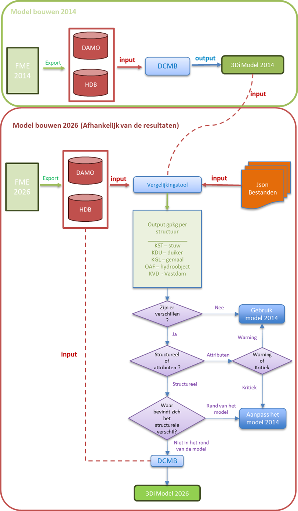
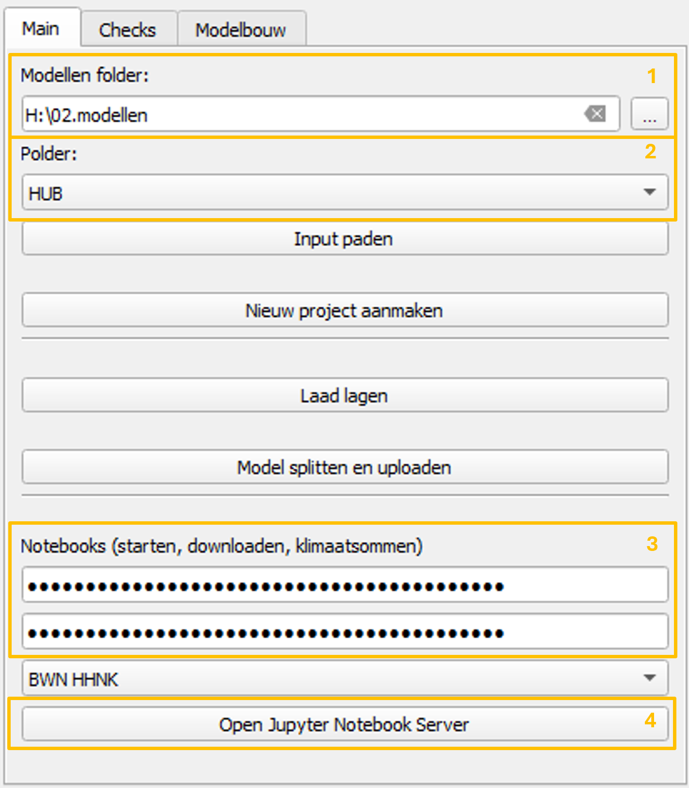
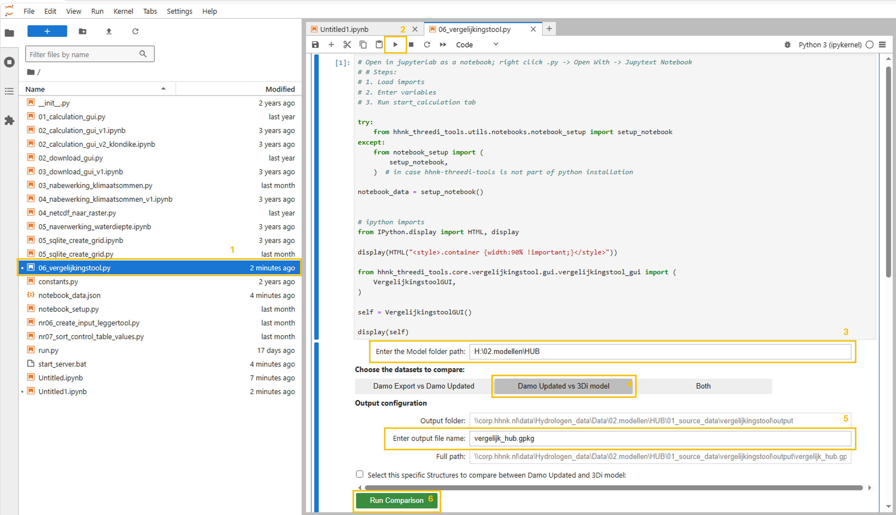

# Vergelijkingstool DAMO / modelgegevens

Met de vergelijkingstool zijn de verschillen tussen actuele DAMO-data te vergelijken met de gegevens in een bestaand model of met een oude DAMO-data-set. De tool helpt modelleurs de actualiteit van het model te beoordelen. De tool vergelijkt onder andere:

| Onderdeel | Controle |
| --- | --- |
| Watergangen | Aanwezigheid, geometrie en attributen |
| Kunstwerken | Verschillen in ligging en kenmerken |
| Peilgebieden | Controle van actuele grenzen en waterpeilen |
| Modelinput | Vergelijking tussen de bestaande modelgegevens en de nieuwe DAMO-export |

Het doel is niet om automatisch te bepalen wat “goed” of “fout” is, maar om verschillen zichtbaar te maken, zodat daarna een inhoudelijke beoordeling kan worden uitgevoerd.

---

## Workflow

# TODO @JUAN de afbeelding bevat een spelfout. aanpass moet 'pas het bestaande model aan' zijn. Een waarom gebruik je specifiek 2014? Dat kan elk jaar zijn toch? Ik vind de figuur niet zo duidelijk. Kun je wat tekst schrijven wat er in staat en waarom het nuttig is?

De vergelijkingstool kan de gegevens van een eerdere modelbouw vergelijken met een bestaand model en met een oude gegevens set. Onderstaande figuur geeft de globale workflow van de vergelijkingstool weer bij de vergelijking van een gegevens set uit 2014 met een set uit 2026.



## Benodigde input

De tool verwacht de volgende bestandsstructuur:

```text
model_folder/
    │
    ├── 01_source_data/
    │   ├── vergelijkingstool/
    │   │   ├── input_data_old/
    │   │   │   ├── DAMO.gpkg
    │   │   │   ├── HDB.gpkg
    │   │   │
    │   │   ├── output/
    │   │   │   ├── vergelijkingstool_output.gpkg
```

> Let op: de naam van het outputbestand kan worden aangepast op basis van het model of het studiegebied. De mappen worden automatisch aangemaakt zodra het pad in de vergelijkingstool is ingevoerd. Daarna moeten de GeoPackage-bestanden worden gekopieerd en geplakt in de map `input_data_old`.

---

## Minimale vereisten

| Bestand / map | Beschrijving |
| --- | --- |
| `DAMO.gpkg` | Recente export van de DAMO-data |
| `HDB.gpkg` | Gegevens die eerder in het model zijn gebruikt |
| `output/` | Map waarin de resultaten van de vergelijking worden opgeslagen |

Als de bestanden niet op de juiste locaties staan, is de kans groot dat de tool niet werkt. Daarnaast is het belangrijk om te vermelden dat het model de afgesproken mappenstructuur moet volgen. Als dat niet het geval is, zal de tool niet goed functioneren.

De minimale mappenstructuur van het model is:

```text
model_folder/
    ├── 00_config
    ├── 01_source_data
    ├── 02_schematisation
    ├── 03_3di_results
    ├── 04_test_results
    ├── Notebooks
```

---

## **Handleiding**

De `vergelijkingstool` wordt gebruikt vanuit de QGIS-plugin en wordt vervolgens uitgevoerd vanuit JupyterLab.

De workflow bestaat uit twee hoofdonderdelen:

1. JupyterLab openen vanuit de QGIS-plugin.
2. De `vergelijkingstool` uitvoeren vanuit het notebook.

---

### 1. JupyterLab openen vanuit de QGIS-plugin

Het eerste deel van het proces wordt uitgevoerd vanuit het hoofdtabblad van de plugin.



#### **Stap 1. De modellenmap selecteren**

In het veld *“Modellen folder”* moet de hoofdmap worden geselecteerd waarin de modellen zijn opgeslagen. Deze map is de basismap van waaruit de plugin de beschikbare modellen zoekt.

#### **Stap 2. De polder of het model selecteren**

In het veld *“Polder”* moet de polder of het model worden geselecteerd waarmee gewerkt gaat worden. Nadat de modellenmap is geselecteerd, toont de plugin de beschikbare opties in deze lijst.

#### **Stap 3. De API keys controleren**

Voordat verder wordt gegaan, moet worden gecontroleerd of de benodigde *API keys* correct zijn ingesteld en opgeslagen in de juiste map. Deze API keys zijn nodig om de notebooks verbinding te laten maken met de vereiste services en correct uit te voeren.

#### **Stap 4. De Jupyter Notebook Server openen**

Klik vervolgens op de knop *“Open Jupyter Notebook Server”*. Deze knop start de Jupyter Notebook Server en opent JupyterLab in de standaardbrowser.

---

### 2. De vergelijkingstool uitvoeren vanuit JupyterLab

Zodra JupyterLab in de browser is geopend, moet het bestand worden geopend en uitgevoerd dat hoort bij de `vergelijkingstool`.



#### **Stap 1. Het bestand `06_vergelijkingstool.py` openen**

Zoek in het linkerpaneel van JupyterLab het bestand `06_vergelijkingstool.py`.

Om het bestand correct te laten werken, moet het met **Jupytext** als notebook worden geopend.

Doe dit als volgt:

* Klik met de rechtermuisknop op `06_vergelijkingstool.py`
* Selecteer **Open With**
* Selecteer **Jupytext Notebook**

Hiermee wordt het `.py` bestand geopend als een uitvoerbaar notebook binnen JupyterLab.

#### **Stap 2. Het notebook uitvoeren**

Zodra het bestand als notebook is geopend, klik je op de knop *Run*. Deze knop voert de hoofdcel uit en toont de grafische interface van de `vergelijkingstool` binnen het notebook.

#### **Stap 3. Het modelpad controleren**

In het veld *“Enter the Model folder path”* moet de locatie van het model waarmee gewerkt wordt worden gecontroleerd of ingevoerd. Dit pad moet overeenkomen met het model dat eerder in de QGIS-plugin is geselecteerd.

#### **Stap 4. Het type vergelijking selecteren**

Selecteer vervolgens de optie: **`Damo Updated vs 3Di model`**

Deze optie vergelijkt de geactualiseerde DAMO-database met de gegevens die in het 3Di-model zijn gebruikt. Als de mappenstructuur niet correct is ingericht, kan de `vergelijkingstool` de benodigde bestanden niet vinden en zal de tool niet goed werken.

# TODO WAAR STAAT HET MODEL? WORDT STANDAARD NAAR HET BASISMODEL GEKEKEN? WAT IS DAMO UPDATED? IS DAT NIEUW? BIJ DEZE OPTIE HEB JE DUS GEEN DAMO OLD NODIG? HET IS VERWARREND ALS DAMO NIEUW UIT DE SOURCE DATA KOMT EN HET MODEL UIT DE BASIS SCHEMATISATIE. DAN MOET JE DUS EEN MODELMAP HEBBEN WAARIN ZOWEL NIEUWE ALS OUDE GEGEVENS STAAN, DAT HEB JE NOOIT EN IS HEEL ERG VERWARREND. KAN DIT OOK ALLEMAAL IN DE APARTE MAP?

#### **Stap 5. De naam van het outputbestand definiëren**

In het veld **“Enter output file name”** moet de naam van het outputbestand worden ingevoerd. De naam moet eindigen op de extensie `.gpkg`.

Bijvoorbeeld:

`vergelijkingstool_output.gpkg`

#### **Stap 6. De vergelijking uitvoeren**

Wanneer alle instellingen klaarstaan, klik je op de knop *“Run Comparison”*. De tool voert de vergelijking tussen de geselecteerde databases uit en genereert het outputbestand. De volledige locatie van het gegenereerde bestand wordt weergegeven in het veld *“Full path”*. Dit `.gpkg`-bestand kan daarna in QGIS worden geopend om de gevonden verschillen te beoordelen.

---

## Interpretatie van de resultaten

De output van de `vergelijkingstool` moet niet alleen worden geïnterpreteerd als een lijst met fouten.  
De resultaten dienen als ondersteuning om te beoordelen of het bestaande model nog kan worden hergebruikt, gedeeltelijk moet worden geactualiseerd of beter opnieuw kan worden opgebouwd met recentere brongegevens.

De beoordeling moet zich vooral richten op:

- Het type verschil: `attribuut verschillen` of `structuurverschillen`.
- De classificatie van het verschil: `Warning` of `Critical Error`.
- De locatie van het verschil binnen het systeem.
- De mogelijke hydraulische invloed op het model.
- De complexiteit van een eventuele handmatige correctie.

Als algemene richtlijn geldt:

| Situatie | Mogelijke beslissing |
| --- | --- |
| Er zijn geen relevante verschillen | Het bestaande model hergebruiken |
| Er zijn vooral verschillen in attributen | Het bestaande model actualiseren |
| Er zijn kritieke structurele verschillen in belangrijke delen van het systeem | Overwegen om het model opnieuw op te bouwen |
| De verschillen liggen aan de randen van het model of zijn geïsoleerde gevallen | Beoordelen of ze handmatig kunnen worden gecorrigeerd |

Ook als er bijvoorbeeld veel verschillen in de attributen zijn kan het efficiënter zijn om het model opnieuw op te bouwen. De uiteindelijke beslissing moet door de modelleur worden genomen op basis van een inhoudelijke beoordeling van de lagen die in QGIS zijn gegenereerd. Voor een uitgebreidere beschrijving van het beoordelingsproces en de vastlegging van de beslissing, zie het criteria-document:

[Document met criteria voor de vergelijkingstool](https://corphhnk-my.sharepoint.com/:w:/g/personal/j_acostabarragan_hhnk_nl/IQAnmle5aVm8QIQ1-YdJs5yTATWDOvRhuQel_Nb1JKrNoP8?e=Lrqv8t)

Ten slotte kan het zijn dat de adviseur van watersystemen reden ziet om het model aan te passen of opnieuw op te bouwen op basis van de bestaande resultaten.

---

## Aanbevolen werkwijze in het kort

1. Controleer eerst of de gebruikte DAMO-export recent is.
2. Open het resultaat in QGIS.
3. Beoordeel de belangrijkste verschillen.
4. Vergelijk de gemarkeerde objecten met de oorspronkelijke modelgegevens.
5. Bespreek twijfelgevallen met de inhoudelijk verantwoordelijke adviseur.
6. Documenteer welke verschillen moeten worden gecorrigeerd en welke kunnen worden geaccepteerd.

---

## Contact

Voor vragen over de inhoud van het model:

**Modelleur:** Juan Acosta  
**Team:** Hydrologie / HHNK

Voor technische problemen met de tool kan contact worden opgenomen met de beheerder van de vergelijkingstool.
